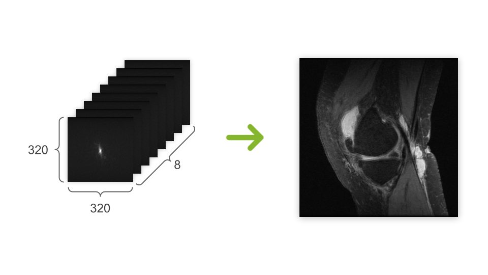

# MRI-CUDA  

## Project Overview  
MRI-CUDA is a project developed for the Digital Systems M course by Alfredo Grande and Edoardo Bosi.  
The application processes raw k-space MRI data and reconstructs the corresponding images using a 2D inverse Fourier transform (IFFT) implemented in CUDA.

The goal of this project is to optimize the performance of the IFFT algorithm and the entire processing pipeline—including data loading, memory management, and additional computations—using CUDA.

## Input Data 
The input data must be in the MRD format (from [mridata.org](http://www.mridata.org/)). The ISMRMRD library is used to parse and process the data.

## Implemented Operations  
- 2D Inverse FFT (Cooley-Tukey Algorithm)  
- Matrix transposition  
- Frequency shift (quadrant swap)  
- Channel combination (root sum of squares)  
- Image normalization and flipping  

## Performance Results  

| Version | Time (s) | Speedup (compared to sequential -O3) |
|-----------------------------|---------|---------------------------|
| Sequential -O0 | 165.5 | - |
| Sequential -O3 | 16.465 | 1x |
| CUDA (Sequential FFT1D) | 19.482 | 0.85x |
| CUDA (Parallel FFT1D) | 5.174 | 3.18x |
| CUDA (with streams) | 5.087 | 3.23x |
| CUDA (Optimized FFT1D) | 4.884 | 3.37x |
| CUDA (Parallel operations and other optimizations) | 0.714 | **23.06x** |  

## Authors  
Alfredo Grande, Edoardo Bosi  